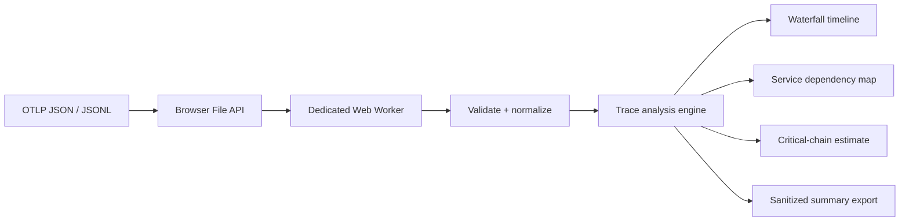

# TraceVista

**A privacy-first OpenTelemetry trace inspector that runs entirely in the browser.**

[Live demo](https://tracevista.vercel.app) · [OTLP file format](https://opentelemetry.io/docs/specs/otel/protocol/file-exporter/) · [MIT license](./LICENSE)

TraceVista turns OTLP JSON or JSONL exports into an interactive trace waterfall, service dependency map, latency distribution, error summary, and estimated critical chain. There is no backend, authentication, database, analytics SDK, or telemetry upload.

## Why this project exists

Trace viewers are usually coupled to a collector and hosted observability platform. TraceVista is a deliberately small alternative for quick inspection, debugging exported fixtures, and teaching distributed tracing concepts without provisioning infrastructure or sharing production data with another service.

## Features

- Imports standards-based OTLP `TracesData` JSON and JSONL files.
- Processes up to 10 MB or 25,000 spans in a dedicated Web Worker.
- Preserves nanosecond timestamp correctness by parsing with `BigInt` and converting only relative trace offsets to numbers.
- Builds parent/child indexes, self time, latency percentiles, errors, service dependencies, and an estimated critical chain.
- Visualizes traces as a virtualized waterfall and services as an interactive dependency graph.
- Surfaces malformed spans, duplicate IDs, missing parents, missing service names, and cyclic parent links without hiding usable data.
- Keeps imported traces in memory only and performs no upload or persistence.
- Includes a deterministic synthetic checkout trace with a cache miss, slow database call, payment timeout, retry, and failed checkout.
- Exports a derived JSON summary without raw span attributes.

## Try it locally

Requirements: Node.js 22+ and pnpm 10.8.1.

```bash
pnpm install
pnpm dev
```

Open [http://localhost:3000](http://localhost:3000) and select **Load sample trace**, or import an OpenTelemetry file-exporter JSON/JSONL file.

```bash
pnpm lint
pnpm typecheck
pnpm test
pnpm exec playwright install chromium
pnpm test:e2e
pnpm build
```

## Architecture



The Next.js App Router renders the public shell and metadata at build time. The interactive workbench is a Client Component, while all parsing and graph analysis execute in `trace.worker.ts`. `output: "export"` produces static assets that can be hosted without a Node.js runtime.

### Data flow

1. The browser checks extension and byte size before reading a selected file.
2. The worker parses either a single OTLP `TracesData` object or newline-delimited objects.
3. Valid spans are grouped by trace and indexed by span ID. Invalid entries become aggregated import warnings.
4. Absolute nanosecond timestamps remain `BigInt`; the engine derives relative microseconds per trace before creating UI-safe numbers.
5. The worker sends normalized, serializable analysis results back to React. Raw input text is not retained in application state.

## Analysis details

### Self time

For each span, TraceVista clips direct-child intervals to the parent range, merges overlaps, and subtracts their union from the parent duration. This avoids double-counting parallel children.

### Estimated critical chain

The engine scores every root-to-leaf parent path using accumulated span self time and highlights the highest-scoring path. It is intentionally called an estimate: asynchronous span links, missing instrumentation, and work outside recorded spans can change the true critical path.

### Error classification

A span is classified as an error when it has OTLP status code `ERROR`, a non-empty `error.type` attribute, or an `exception` event. Service edges aggregate call count, child-span error count, median latency, and p95 latency.

## Privacy and security model

- No API routes, Server Actions, serverless functions, databases, cookies, or runtime secrets.
- Imports are processed locally and discarded on reset or tab close.
- Attribute values are rendered as React text, never interpreted as HTML.
- The JSON summary excludes raw span and resource attributes.
- File-size and span-count limits bound memory and CPU work.

TraceVista is a local inspection tool, not a replacement for access controls around the source telemetry. Exported traces can still contain sensitive attributes before they are imported.

## Verification

| Check | Result |
| --- | --- |
| Unit and component tests | 26 passing |
| Parsing/analysis statement coverage | 96.75% |
| Playwright workflows | 4 passing |
| Axe accessibility scan | 0 violations on landing and analysis states |
| Deterministic 10,000-span core benchmark | 34–55 ms in local Vitest runs |
| Lighthouse (production static build) | 95 Performance · 100 Accessibility · 100 Best Practices · 100 SEO |
| Lighthouse responsiveness | 0 ms total blocking time · 0 cumulative layout shift |
| Server functions / environment variables | 0 / 0 |

The benchmark measures parsing plus analysis on an Apple silicon development machine. It is not presented as a universal browser guarantee; the acceptance target is under 1.5 seconds on the reference machine.

## Engineering decisions and trade-offs

- **Static export over a hosted API:** removes cost, data transfer risk, and operational dependencies, but intentionally excludes live OTLP ingestion.
- **Web Worker over main-thread parsing:** keeps interaction responsive at the cost of a serializable boundary between analysis and UI.
- **Relative microseconds over absolute JavaScript numbers:** protects nanosecond timestamp precision while preserving efficient chart calculations.
- **Parent-link critical chain over causal claims:** produces a useful diagnostic signal without pretending incomplete traces encode every async dependency.
- **Session-only state over IndexedDB:** makes the privacy promise simple and auditable, but analyses cannot be reopened after refresh.

## Interview discussion points

- How `BigInt` avoids IEEE-754 precision loss for Unix nanosecond timestamps.
- Why child interval union is required for correct self-time with concurrent spans.
- How cycle and missing-parent handling keeps malformed traces analyzable.
- Why a Web Worker improves perceived responsiveness but does not reduce total CPU work.
- What the critical-chain heuristic can and cannot infer from parent relationships.
- How static deployment reduces both operating cost and attack surface.

## Limitations

Version one does not support live OTLP ingestion, protobuf payloads, span links in critical-chain scoring, vendor-specific formats, authentication, collaboration, or cloud persistence. Percentiles describe only the imported sample and should not be interpreted as production service-level objectives.

## Tech stack

Next.js 16 · React 19 · TypeScript · Tailwind CSS 4 · shadcn/Radix UI · React Flow · TanStack Virtual · Web Workers · Vitest · Playwright · Axe · GitHub Actions · Vercel
